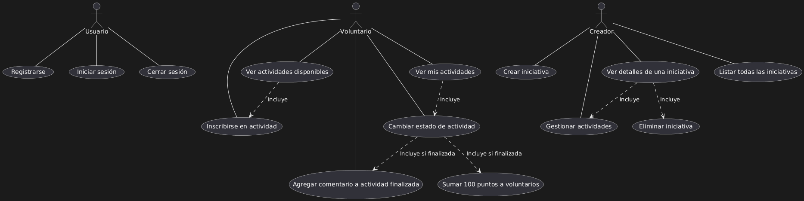

# Gestor de Voluntariado y Actividades Sociales

Aplicación de consola en Java que permite gestionar usuarios, iniciativas y actividades sociales.
Incluye persistencia de datos mediante archivos XML y gestión de sesiones con patrón Singleton.

---

## Descripción

El proyecto consiste en el desarrollo de una aplicación para la gestión de iniciativas y actividades de voluntariado. El programa se centra en permitir que los usuarios se registren en el sistema y según el tipo de usuario podrán realizar diferentes acciones:

### Tipos de Usuarios

- **Creadores**:

  - Crean iniciativas, como campañas de recolección de alimentos, limpieza de espacios públicos o apoyo a refugios
  - Pueden crear actividades específicas dentro de cada iniciativa
- **Voluntarios**:

  - Participan en las diferentes actividades disponibles
  - Pueden actualizar el estado de las actividades
  - Reciben 100 puntos por cada actividad finalizada

### Características Principales

- **Sistema de Autenticación**:

  - Protección mediante usuario y contraseña
  - Validación de datos y correos electrónicos con expresiones regulares
- **Gestión de Actividades**:

  - Estados de avance: PENDIENTE, EN CURSO, FINALIZADA
  - Seguimiento del progreso de cada actividad
- **Persistencia de Datos**:

  - Almacenamiento persistente de toda la información
  - Conservación de datos de iniciativas, actividades y usuarios
  - Implementación mediante archivos XML

---

## Tecnologías Detalladas

### Java Core

- Versión: Java 17+
- Características utilizadas:
  - Collections Framework
  - LocalDate para manejo de fechas
  - Interfaces funcionales

### JAXB (Java Architecture for XML Binding)

- Versión: 2.3.1
- Uso:
  - Serialización/deserialización de objetos a XML
  - Anotaciones: @XmlRootElement, @XmlElement, @XmlAccessorType
  - Adaptadores personalizados para LocalDate
  - Configuración mediante binding.xml

### Maven

- Versión: 3.8.1
- Plugins principales:
  - maven-compiler-plugin (v3.8.0)
  - maven-surefire-plugin (v2.22.2)
  - maven-assembly-plugin (para crear JAR ejecutable)

### IDE Recomendado: IntelliJ IDEA

- Versión: 2023.3 o superior (Community Edition)
- Plugins necesarios:
  - XML Tools (para JAXB)
  - SonarLint
  - Git Integration

---

## Estructura del Proyecto

### `src/main/java/controllers/`

- `ActividadController`: Gestión de actividades y sus estados
- `AplicacionController`: Control principal de la aplicación
- `IniciativaController`: Gestión de iniciativas de voluntariado
- `SesionUsuario`: Manejo de la sesión actual (Singleton)
- `UsuarioController`: Gestión de usuarios y autenticación

### `src/main/java/model/`

- `Usuario`: Clase base para usuarios del sistema
- `Creador`: Gestión de iniciativas y actividades
- `Voluntario`: Participación y puntuación en actividades
- `Iniciativa`: Definición de proyectos de voluntariado
- `Actividad`: Eventos y tareas específicas
- `ActividadLista`: Gestión de colecciones de actividades
- `IniciativaLista`: Gestión de colecciones de iniciativas
- `UsuariosLista`: Gestión de colecciones de usuarios

### `src/main/java/views/`

- `VistaMenu`: Menú principal
- `VistaUsuario`: Gestión de perfil
- `VistaIniciativa`: Gestión de iniciativas
- `VistaActividad`: Gestión de actividades
- `VistaComun`: Funcionalidades compartidas entre vistas

### `src/main/java/utils/`

- `AdaptadorLocalDateXml`: Conversión de fechas para XML
- `GeneradorID`: Generación de identificadores únicos
- `PasswordUtilidades`: Gestión de contraseñas
- `UtilidadesGenerales`: Funciones de utilidad común

### `src/main/java/exceptions/`

- `ActividadExisteException`: Control de duplicados
- `ActividadNoEncontradaException`: Validación de existencia
- `EmailInvalidoException`: Validación de correos
- `FechaNoValidaException`: Validación de fechas
- `IniciativaExisteException`: Control de duplicados
- `IniciativaNoEncontradaException`: Validación de existencia
- `PasswordInvalidaException`: Validación de contraseñas

### `src/main/java/interfaces/`

- `Estado`: Enumeración de los estados de actividades
- `Gestionable`: Interfaz para objetos gestionables

### `src/main/java/dataAccess/`

- `XMLManager`: Gestión de persistencia en XML

---

## Funcionalidades principales

- Registro de usuarios (voluntarios y creadores)
- Inicio de sesión con sistema de sesión basado en Singleton
- Creación y visualización de iniciativas
- Creación y asignación de actividades dentro de iniciativas
- Asignación de voluntarios a actividades
- Almacenamiento persistente en archivos XML
- Manejo de excepciones personalizadas

---

## Diagrama de Clases

El siguiente diagrama representa la estructura principal de clases, sus relaciones y responsabilidades:

## Diagrama de Casos de Uso

A continuación, se detallan los principales casos de uso para creadores y voluntarios dentro del sistema:

---

## Consideraciones

- Las clases que se serializan en XML deben estar anotadas con `@XmlRootElement`.
- `LocalDate` se gestiona mediante un `XmlAdapter` personalizado.
- Se utiliza patrón **Singleton** para la sesión del usuario autenticado.
- El sistema funciona en un solo hilo (no multithread).
- Los voluntarios obtienen **100 puntos por cada actividad completada**.
- Los creadores tienen un campo adicional: **ONG afiliada**.

---

## Autor

- Hecho por:
  - Fco Javier García Cañero
  - David Montoro Guillén
  - Pedro Antonio Nadales Luque
  - Rafael Valenzuela Osuna
- Proyecto académico para IES Francisco de los Rios
